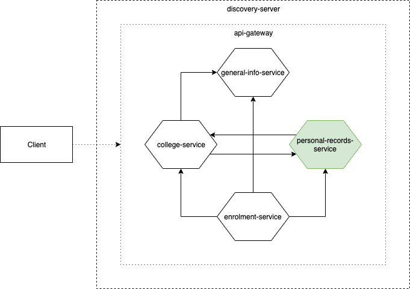

# Overview
The personal-records service takes care of the data related to the personal information of all those subject to the university. These includes:
1. Student - students of the university take up degrees and enroll to necessary courses to graduate
2. Faculty - faculties fulfill the university's main purpose, to serve as the primary source of knowledge by teaching the courses to students
3. Staff - personnel undertaking various responsibilities that benefit the university

This service uses [genuniv-common-service](https://github.com/carzanodev/genuniv-common-service) as its chassis.

# Relations Diagram

## Request to Other Services
The personal-records service requests data from the following services via its APIs:
1. [college-service](https://github.com/carzanodev/genuniv-college-service)
    * College
    * Degree
    
The retrieval of the data are done via a dedicated thread that periodically requests from the APIs. The data are also being cached afterwards.

# Access Endpoints
The personal-records service follows the standardized usage format explained in [genuniv-general-docs](https://github.com/carzanodev/genuniv-general-docs).
1. `/api/v1/student`
2. `/api/v1/faculty`
3. `/api/v1/staff`